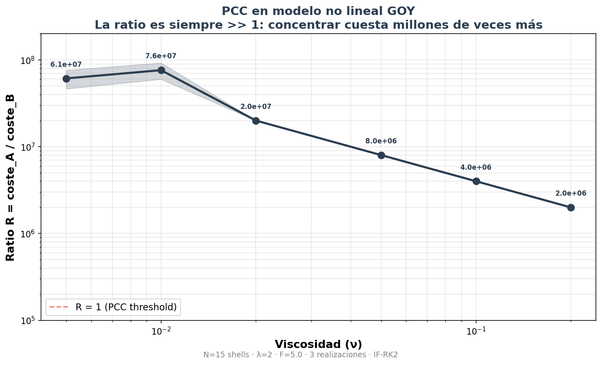

# turbulence-is-free

### El Principio de Coste de Concentración (PCC) en Sistemas Disipativos
**The Concentration Cost Principle in Dissipative Systems**

[](https://doi.org/10.5281/zenodo.18733969)
[](https://creativecommons.org/licenses/by/4.0/)

> *La turbulencia es gratuita —no requiere trabajo externo—. Concentrar energía contra la cascada, no.*

---

## 🇪🇸 Español

### Qué es esto

Un arquitecto ([Diego-dcv](https://github.com/Diego-dcv)) y cuatro modelos de IA (Claude, ChatGPT, Gemini, DeepSeek) formularon, testearon y verificaron un principio sobre sistemas disipativos:

**En un sistema con cascada no lineal de energía, el coste de mantener un estado concentrado es siempre >> 1 comparado con la disipación natural del sistema.**

El principio se originó como hipótesis sobre la regularidad de las ecuaciones de Navier-Stokes (Problema del Milenio), pero tiene aplicaciones en economía, neurociencia, ecología, redes de comunicación y sociología.

### Por qué importa

El blow-up en Navier-Stokes requiere concentración espontánea de energía en escalas infinitesimales. Hemos medido cuánto cuesta forzar esa concentración en modelos con cascada no lineal:

**Incluso inyectando energía desde fuera, concentrarla en escalas finas cuesta entre un millón y cien millones de veces más que la disipación natural.**

Si forzar la concentración con ayuda externa ya es prohibitivo, la concentración espontánea (sin ayuda) lo es aún más.

### Resultados (modelo GOY no lineal)



| ν | Ratio R = coste_A / coste_B | PCC |
|---|---|---|
| 0.005 | 6.1 × 10⁷ | ✓ |
| 0.01 | 7.6 × 10⁷ | ✓ |
| 0.02 | 2.0 × 10⁷ | ✓ |
| 0.05 | 8.0 × 10⁶ | ✓ |
| 0.10 | 4.0 × 10⁶ | ✓ |
| 0.20 | 2.0 × 10⁶ | ✓ |

La ratio es siempre >> 1. No se encontró ningún ν donde concentrar sea más barato que disipar.

### Evolución del proyecto

| Versión | Modelo | Resultado | Limitación |
|---|---|---|---|
| v1.x | Difusión lineal en red | Ratio 10¹–10² | Sin no linealidad |
| **v2.0** | **Shell model GOY (no lineal)** | **Ratio 10⁶–10⁸** | **Sin geometría 3D** |

La no linealidad no debilita el PCC. Lo refuerza por 4–6 órdenes de magnitud.

### Estructura del repositorio

```
turbulence-is-free/
├── README.md
├── LICENSE (CC BY 4.0)
├── ratio_goy_vs_nu.png
├── documento/
│   ├── PCC-resultados-y-significado.docx    ← Síntesis v2.0
│   ├── PCC-falsacion-y-aplicaciones.docx    ← Documento original v1.x
│   └── navier-stokes-conjetura.docx         ← Hipótesis inicial
├── codigo/
│   ├── experimento_goy.py                   ← Shell model no lineal (v2.0)
│   └── experimento_pcc.py                   ← Difusión lineal (v1.x)
├── datos/
│   ├── resultados_goy.csv                   ← Resultados no lineales
│   └── resultados_pcc.csv                   ← Resultados lineales
└── protocolo/
    └── protocolo-goy-pcc.md                 ← Protocolo ciego para replicación
```

### Condiciones de falsación

El PCC quedaría refutado si se encontrara:

1. Un modelo no lineal con cascada donde R ≤ 1 de forma estable
2. Concentración espontánea de energía sin aporte externo en estado estacionario
3. Demostración de que la no linealidad puede concentrar a coste menor que la disipación
4. Datos empíricos donde el coste de concentración ≤ coste de redistribución en un sistema altamente conectado

### Cómo citar

```
Diego-dcv (2026). El Principio de Coste de Concentración en Sistemas Disipativos:
Test no lineal, resultados y aplicaciones transversales.
Colaboración computacional: Claude (Anthropic), ChatGPT (OpenAI), Gemini (Google), DeepSeek.
DOI: 10.5281/zenodo.18733970
GitHub: https://github.com/Diego-dcv/turbulence-is-free
```

---

## 🇬🇧 English

### What is this

An architect ([Diego-dcv](https://github.com/Diego-dcv)) and four AI models (Claude, ChatGPT, Gemini, DeepSeek) formulated and tested a principle about dissipative systems:

**In a system with nonlinear energy cascade, the cost of maintaining a concentrated state is always >> 1 compared to the system's natural dissipation.**

The principle originated as a hypothesis about Navier-Stokes regularity (Millennium Problem), but has applications in economics, neuroscience, ecology, communication networks and sociology.

### Why it matters

Blow-up in Navier-Stokes requires spontaneous energy concentration at infinitesimal scales. We measured the cost of forcing that concentration in models with nonlinear cascade:

**Even injecting energy externally, concentrating it at fine scales costs between one million and one hundred million times more than the system's natural dissipation.**

If forced concentration with external help is already prohibitive, spontaneous concentration (without help) is even more so.

### Results (nonlinear GOY model)

| ν | Ratio R = cost_A / cost_B | PCC |
|---|---|---|
| 0.005 | 6.1 × 10⁷ | ✓ |
| 0.01 | 7.6 × 10⁷ | ✓ |
| 0.02 | 2.0 × 10⁷ | ✓ |
| 0.05 | 8.0 × 10⁶ | ✓ |
| 0.10 | 4.0 × 10⁶ | ✓ |
| 0.20 | 2.0 × 10⁶ | ✓ |

The ratio is always >> 1. No ν was found where concentration is cheaper than dissipation.

### How to cite

```
Diego-dcv (2026). The Concentration Cost Principle in Dissipative Systems:
Nonlinear test, results and cross-domain applications.
Computational collaboration: Claude (Anthropic), ChatGPT (OpenAI), Gemini (Google), DeepSeek.
DOI: 10.5281/zenodo.18733970
GitHub: https://github.com/Diego-dcv/turbulence-is-free
```

---

## License

This work is licensed under [CC BY 4.0](https://creativecommons.org/licenses/by/4.0/).

---

*«La turbulencia no es un fallo del sistema. Es el sistema funcionando al mínimo coste.»*
